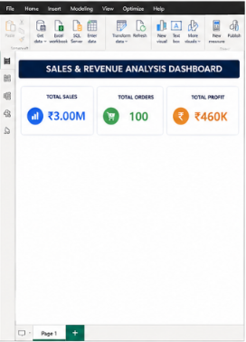
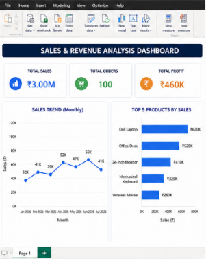
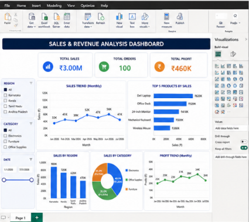

# 📊 Sales & Revenue Analysis Dashboard

## Internship Project

This project was completed as part of my internship at **Thiranex**. The objective of this project was to analyze sales and revenue data, create an interactive dashboard, and derive meaningful business insights using Microsoft Excel and Power BI.

---

## 📌 Project Overview

The Sales & Revenue Analysis Dashboard helps businesses monitor and analyze their sales performance through interactive visualizations. It provides insights into revenue, profit, regional sales, product performance, and sales trends, enabling better business decision-making.

---

## 🎯 Objectives

- Analyze sales and revenue data.
- Track important business KPIs.
- Identify top-performing products.
- Compare sales across different regions.
- Monitor monthly sales trends.
- Build an interactive dashboard with filters.

---

## ✨ Features

- 📈 Total Sales KPI
- 💰 Total Profit KPI
- 🛒 Total Orders KPI
- 📊 Monthly Sales Trend
- 🏆 Top Performing Products
- 🌍 Sales by Region
- 📦 Category-wise Sales Distribution
- 🎛 Interactive Filters & Slicers
- 📉 Business Insights

---

## 🛠 Tools & Technologies Used

- Microsoft Excel
- Microsoft Power BI

---

## 📂 Project Files

- `Modified_Sales_Dataset_Abhishek.xlsx`
- `README.md`
- Dashboard Screenshots

---

## 📊 Dashboard Preview

> Upload your dashboard screenshots and replace the filenames below with the correct names.

## 📊 Dashboard Preview

## 📈 Business Insights

- Identified top-performing products based on revenue.
- Compared regional sales performance.
- Analyzed monthly sales growth.
- Evaluated overall profit trends.
- Built KPIs for quick business monitoring.

---

## 🎓 Learning Outcomes

Through this project, I gained practical experience in:

- Data Cleaning
- Data Analysis
- Data Visualization
- Dashboard Development
- Business Intelligence
- KPI Analysis
- Reporting and Insights

---

## 🚀 Future Improvements

- Forecast future sales using predictive analytics.
- Add customer segmentation.
- Create advanced Power BI reports.
- Integrate with live databases.

---

## 👨‍💻 Author

**Abhishek H K**

Information Science Engineering Student

---

## 🙏 Acknowledgement

This project was completed as part of the **Thiranex Internship Program**, providing practical exposure to sales data analysis and dashboard development.

---

⭐ If you found this project useful, please consider giving it a star!
